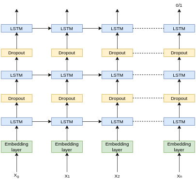

# Sentiment-Analysis
Sentiment Analysis in Keras using LSTM model

### Model architecture

### Dataset:
The dataset we are going to use is very popular among researchers in Natural Language Processing, usually referred to as the [IMDb dataset](http://ai.stanford.edu/~amaas/data/sentiment/)
